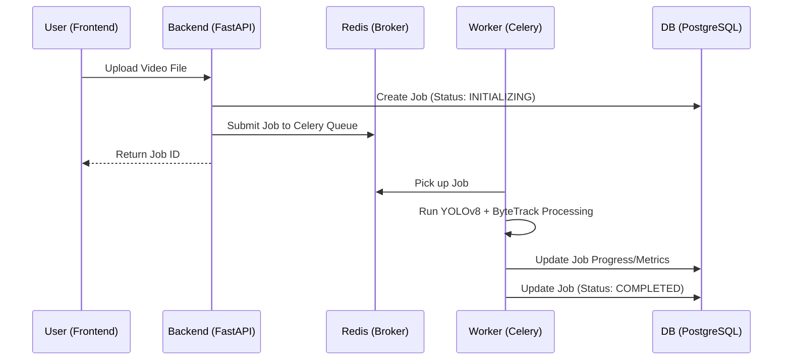
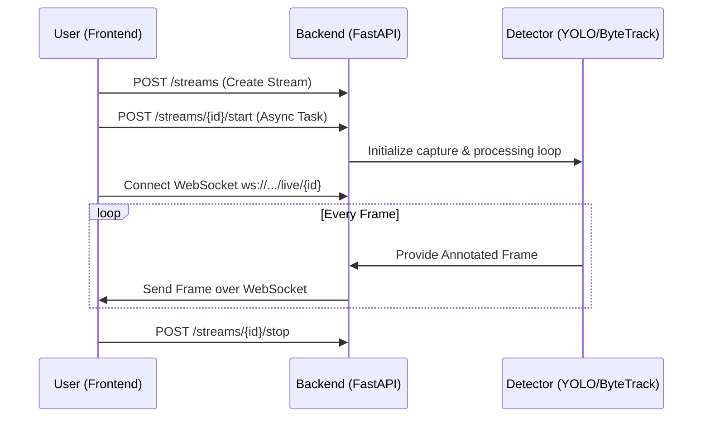
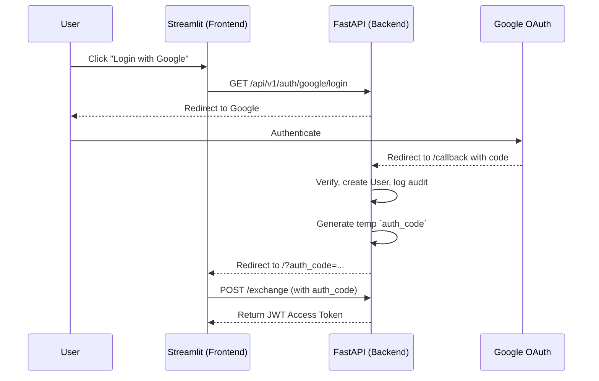

# High-Level Design (HLD)

## System Architecture Overview
The system is built as a multi-container Docker application utilizing modern microservice principles. The `docker-compose.yml` defines the following actual services:
- **db (`postgres:15-alpine`):** PostgreSQL database for persisting users, jobs, projects, and streams.
- **redis (`redis:7-alpine`):** In-memory data store acting as the Celery message broker and result backend.
- **db-init:** A transient service that runs Alembic migrations (`alembic upgrade head`) and exits.
- **backend:** The core FastAPI application that serves REST APIs and WebSocket endpoints.
- **worker:** A Celery worker running the `core.execution.worker` to process offline video jobs asynchronously.
- **frontend:** A Streamlit-based web application that communicates with the backend APIs.

## Data Flow Diagrams

### Offline Video Processing

### Live Streaming Flow

### Authentication Flow (Google OAuth)

## Technology Choices and Rationale
- **Detection & Tracking:** Uses Ultralytics YOLOv8 for object detection. It defaults to exporting to ONNX Runtime for significant CPU acceleration, with PyTorch as a fallback. Tracking is handled by ByteTrack via the `supervision` library, standardizing frame annotations.
- **Backend Framework:** FastAPI is chosen for its native async capabilities, which are crucial for handling WebSockets and concurrent API requests.
- **Asynchronous Execution:** Celery paired with Redis allows heavy video processing tasks to run independently of the web server, ensuring the API remains responsive.
- **Database & ORM:** PostgreSQL managed via SQLAlchemy and Alembic provides relational integrity for user and job data.
- **Authentication:** JWT-based stateless authentication allows the frontend to easily attach tokens to REST headers and WebSocket query parameters. Passwords are hashed using bcrypt.

## Key Architectural Decisions
- **ExecutionBackend Abstraction:** The backend defines an `ExecutionBackend` interface with implementations for `CeleryBackend` and `LocalBackend`. This allows developers to run the application entirely in a local thread pool during development (`EXECUTION_BACKEND=local`) or scale out with Celery (`EXECUTION_BACKEND=celery`) in production.
- **Separation of REST vs. WebSocket:** Live streaming control (start, stop, record) is managed via traditional REST endpoints to easily enforce scoping and status updates, while the actual heavy frame transmission utilizes dedicated async WebSockets (`/live/{id}`).
- **OAuth Code-Exchange Pattern:** Instead of passing the raw JWT token in the URL after OAuth redirection (which poses security risks via browser history), the system issues a short-lived UUID `auth_code`. The frontend exchanges this code securely for the actual JWT token via a POST request.
