# Trackr: AI Video Analytics & Streaming Platform

Trackr is an advanced computer vision platform that leverages YOLOv8 and ByteTrack to provide real-time and offline video analytics. It is designed to be easily deployable, highly observable, and simple to use.

## Features

- **Offline Video Analytics**: Upload videos and generate detailed JSON analytics, CSV telemetry, and spatial heatmaps.
- **Live Streaming**: Connect RTSP cameras or webcams for real-time monitoring and WebSocket-based visualization.
- **Clean Architecture**: Built on FastAPI with strict separation of concerns.
- **Multi-Tenant Workspaces**: Secure user authentication (JWT) and project-based data isolation (SQLite).
- **Production Ready**: Fully Dockerized with Prometheus metrics, JSON logging, and health endpoints.
- **Interactive UI**: A modern Streamlit dashboard for easy interaction.

## Architecture

```mermaid
graph TD
    User([User]) --> Frontend[Streamlit Dashboard]
    Frontend --> Auth[Auth API]
    Frontend --> JobsAPI[Jobs API]
    Frontend --> StreamsAPI[Streams API]
    
    JobsAPI --> JobMgr[Job Manager]
    JobMgr --> Worker[Background Task / CV Pipeline]
    Worker --> YOLO[YOLOv8 Detector]
    Worker --> ByteTrack[ByteTrack]
    
    StreamsAPI --> StreamMgr[Stream Manager]
    StreamMgr --> LiveLoop[Async Inference Loop]
    LiveLoop --> YOLO
    
    Auth --> DB[(SQLite + SQLAlchemy)]
    JobMgr --> DB
```

## Quick Start (Docker Compose)

The easiest way to run Trackr is via Docker Compose:

1. Clone the repository.
2. `cp .env.example .env` and update the `SECRET_KEY`.
3. `docker compose up --build -d`
4. Visit `http://localhost:8501` to use the dashboard!

See [DEPLOYMENT.md](DEPLOYMENT.md) for more detailed deployment instructions.

## Local Development

If you prefer to run it without Docker:

1. Install requirements: `pip install -r requirements.txt`
2. Run migrations: `alembic upgrade head`
3. Start backend: `uvicorn api.main:app --reload`
4. Start frontend: `streamlit run frontend/app.py`

## Roadmap
- [ ] Migrate to PostgreSQL for enterprise deployments.
- [ ] Implement Celery + Redis for distributed background job processing.
- [ ] Add support for custom YOLOv8 model weights upload.
