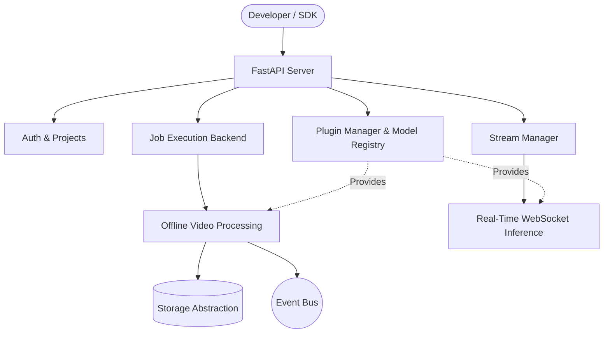

# Trackr: Open Source Computer Vision Platform

[](https://github.com/trackr/trackr/releases)
[](https://github.com/trackr/trackr/actions)
[](https://opensource.org/licenses/MIT)
[](https://www.python.org/downloads/release/python-3110/)
[](https://fastapi.tiangolo.com/)

Trackr is an advanced, modular computer vision platform designed for scalability, ease of use, and enterprise extensibility. Leverage state-of-the-art models (YOLOv8) and tracking algorithms (ByteTrack) to provide real-time and offline video analytics out of the box.

[Documentation](https://docs.trackr.io) | [Getting Started](https://docs.trackr.io/quick-start) | [SDK](https://docs.trackr.io/sdk) | [Examples](examples/README.md)

---

## 🚀 Features

- **Extensible Architecture**: Build and deploy custom Plugins for Detectors, Trackers, and Analytics.
- **Offline Video Analytics**: Upload videos and generate detailed JSON analytics, CSV telemetry, and spatial heatmaps.
- **Live Streaming**: Connect RTSP cameras or webcams for real-time monitoring and WebSocket-based visualization.
- **Official SDK & CLI**: Manage jobs, models, and plugins directly from Python or your terminal (`pip install trackr-sdk`).
- **Multi-Tenant Workspaces**: Secure user authentication (JWT) and project-based data isolation.
- **Production Ready**: Fully Dockerized with Prometheus metrics, JSON logging, and health endpoints.
- **Event-Driven**: An internal pub/sub event bus for decoupled component communication.

---

## 🏗 Architecture



---

## 💻 Quick Start

### 1. Using Docker Compose
The easiest way to run the full platform (API + Streamlit Dashboard):
```bash
git clone https://github.com/trackr/trackr.git
cd trackr
cp .env.example .env
docker compose up --build -d
```
Visit `http://localhost:8501` to use the dashboard!

### 2. Using the CLI
```bash
pip install trackr-sdk
export TRACKR_TOKEN="your_jwt_token"
trackr analyze my_video.mp4
```

### 3. Using the Python SDK
```python
from trackr_sdk import TrackrClient

client = TrackrClient("http://localhost:8000", token="your_token")
job = client.submit_job("intersection.mp4")
print(f"Tracking job started: {job.id}")
```

---

## 🛠 Contributing
We love our contributors! Please see our [Contributing Guidelines](CONTRIBUTING.md) and [Code of Conduct](CODE_OF_CONDUCT.md).

If you find a security issue, please review our [Security Policy](SECURITY.md).

## 📄 License
This project is licensed under the MIT License - see the [LICENSE](LICENSE) file for details.
